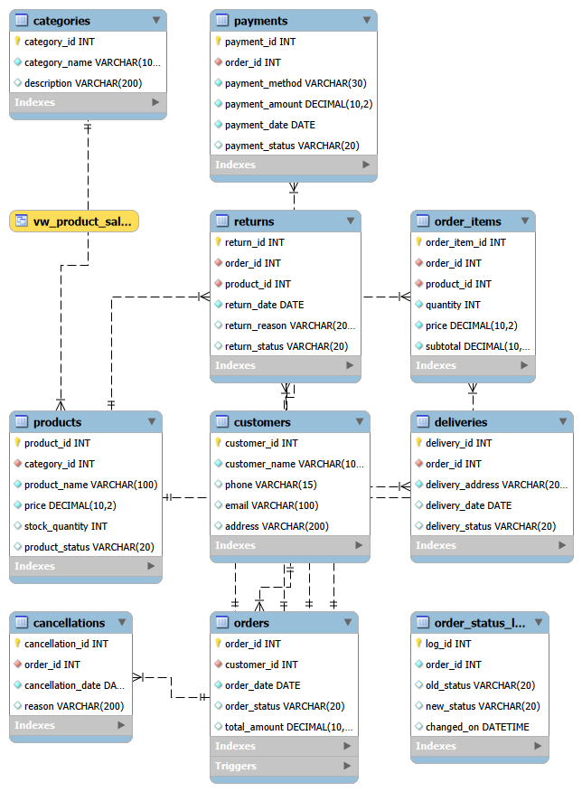

# E-Commerce Order Management System - MySQL

## Overview

Designed and implemented a relational database for an e-commerce platform using MySQL.

The database manages customer information, products, orders, payments, deliveries, returns, and cancellations while maintaining data integrity through primary and foreign key relationships.

---

## Tools Used

- MySQL
- SQL
- Relational Database Design
- ER Modeling

---

## Database Tables

- Categories
- Customers
- Products
- Orders
- Order Items
- Payments
- Deliveries
- Returns
- Cancellations

---

## Features

- Product Catalog Management
- Customer Management
- Order Tracking
- Payment Tracking
- Delivery Monitoring
- Return Processing
- Cancellation Management

---

## Entity Relationship Diagram

---

## Sample SQL Concepts Used

- INNER JOIN
- LEFT JOIN
- GROUP BY
- ORDER BY
- Aggregate Functions
- Subqueries
- Foreign Keys
- Constraints

---

## How to Run

1. Open MySQL Workbench
2. Import ecommerce_order_management.sql
3. Execute the script
4. Run sample queries
